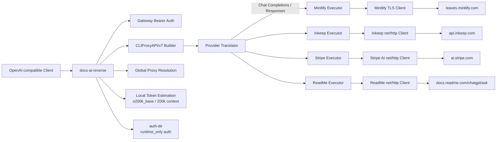

# docs-ai-reverse

[](https://go.dev/)
[](./docs/api.md)
[](./README.en.md)
[](./docs/index.md)
[](./llms.txt)
[](https://6kmfi6hp.github.io/docs-ai-reverse/)
[](https://6kmfi6hp.github.io/docs-ai-reverse/zh.html)

**OpenAI-compatible Docs AI gateway** — adapt Mintlify, Inkeep, Stripe, and ReadMe documentation assistants into local Chat Completions / Responses APIs.

> English entry: [README.en.md](./README.en.md) · Site: [EN](https://6kmfi6hp.github.io/docs-ai-reverse/) / [中文](https://6kmfi6hp.github.io/docs-ai-reverse/zh.html)

`docs-ai-reverse` 是一个 OpenAI-compatible gateway，将多个 Docs AI 后端适配为 OpenAI Chat Completions / Responses API 格式。当前内置四个 provider：Mintlify、Inkeep、Stripe 和 ReadMe。

项目（Go 模块名：`claude-code-chat`）使用 `github.com/router-for-me/CLIProxyAPI/v7` 作为核心框架。网关本身负责统一入口、鉴权、请求翻译、流式响应适配、代理和本地 token 估算；各 provider 负责与对应 Docs AI 服务通信。

**关键词 / Keywords:** OpenAI compatible · Docs AI gateway · Mintlify · Inkeep · Stripe docs AI · ReadMe Ask AI · Claude docs · Anthropic docs · Chat Completions · Responses API · Go reverse proxy · OpenAI 兼容 · 文档 AI 网关 · 反向代理

## 目录

- [功能特性](#功能特性)
- [架构](#架构)
- [Provider 对比](#provider-对比)
- [快速开始](#快速开始)
- [API 使用](#api-使用)
- [配置参考](#配置参考)
- [项目结构](#项目结构)
- [开发说明](#开发说明)
- [已知限制](#已知限制)
- [文档索引](#文档索引)
- [License](#license)

## 功能特性

- 通过 CLIProxyAPI/v7 暴露 OpenAI-compatible API。
- 支持四个固定 provider 和对应模型：`claude-docs`、`anthropic-docs`、`stripe-docs`、`readme-docs`。
- 支持 OpenAI Chat Completions；代码中还注册了 OpenAI Responses → Mintlify 的请求翻译。
- 统一使用配置中的 Bearer token 保护 gateway 入口。
- 支持 runtime-only auth，并将认证信息保存在 `auth-dir`，默认是 `./auths`。
- 支持全局代理：`socks5://`、`http://`、`https://`，以及 `direct` / `none` 直连模式。
- Mintlify 使用带 Chrome TLS fingerprint 的客户端、Chrome CF cookies 和自定义流式协议适配。
- 所有 provider 使用本地 `tiktoken-go`、`o200k_base` 进行 token 估算，并对外宣称最大 200k context tokens。
- 支持 `debug` 日志开关。

## 架构



启动时，`main.go` 通过 CLIProxyAPI Builder 设置 `WithConfig(cfg)`、`WithCoreAuthManager(core)` 和 `WithHooks(hooks)`。`OnAfterStart` 会注册全部四个 provider，并在 750ms 后再次注册一次，以适配 SDK 的启动生命周期。

## Provider 对比

| Provider | `type` | Model | 上游地址 | 上游协议 | 流式行为 | Provider-specific auth attrs |
|---|---|---|---|---|---|---|
| Mintlify | `mintlify` | `claude-docs` | `leaves.mintlify.com` | 自定义 SSE-like `type:value` 行 | `bufio` 逐行扫描并转换为 gateway 响应 | `subdomain`、`site_origin`、`docs_path`、`language` |
| Inkeep | `inkeep` | `anthropic-docs` | `api.inkeep.com` | OpenAI Chat Completions-compatible | 原生 SSE，使用 `data:` 行和 `[DONE]` | `origin`、`referer` |
| Stripe | `stripe` | `stripe-docs` | `ai.stripe.com` | REST create-thread，然后轮询答案 | channel-based polling，每 500ms 一次，最多 120 次 | 无 |
| ReadMe | `readme` | `readme-docs` | `docs.readme.com/chatgpt/ask` | 简单 POST `/ask`，返回 Markdown | 非流式结果包装为 3 个 chunk：role、content、stop | `docs_url`，默认 `https://docs.readme.com` |

四个 provider 在 `main.go` 中始终注册，不需要在 `config.yaml` 中为每个 provider 单独填写 API key。`config.api-keys` 只控制 gateway 自己的 Bearer 鉴权；provider 的认证由 CLIProxyAPI/v7 的 auth 管理流程和各 provider 实现处理。

### Mintlify

- 实现位置：`internal/provider/executor.go`、`internal/mintlify/client.go`、`internal/provider/translator.go`。
- 从 `siteorigin/docs/_mintlify/assistant/siteconfig` 获取 JWT。
- 使用 `github.com/bogdanfinn/tls-client` 提供 Chrome TLS fingerprint，并访问 `leaves.mintlify.com`。
- 通过 `github.com/steipete/sweetcookie` 提取 Chrome CF cookies，或使用代理预热 cookies；cookies 缓存在 `~/.claude-code-cookies.json`。
- 上游不是 OpenAI SSE，而是自定义的 `type:value` 行协议。客户端使用 `bufio` 逐行读取，再转换为 gateway 输出。
- `internal/provider/translator.go` 同时注册 OpenAI Chat Completions → Mintlify 和 OpenAI Responses → Mintlify。
- 工具调用使用 `prompt-tool` 协议：工具会被序列化为 system prompt 中的 `<available_tools>` XML，模型以 `<tool_call>` XML 语法返回调用，响应结束时再解析。
- 认证属性包括 `subdomain`、`site_origin`、`docs_path`、`language`。
- 通过代理访问时如果遇到 418，会尝试不使用代理重试。

Mintlify 可能返回以下 provider-specific 状态：

| 状态 | 含义 |
|---:|---|
| 418 | VPN 或 datacenter egress 可能被拒绝 |
| 419 | token 过期 |
| 420 | Cloudflare bot detection |
| 402 | payment 或 quota 问题 |

### Inkeep

- 实现位置：`internal/provider/inkeep_executor.go`、`internal/inkeep/client.go`。
- 使用标准 `net/http` 访问 `api.inkeep.com`。
- 每次请求前执行 SHA-256 challenge-response。
- 上游使用 OpenAI Chat Completions-compatible 格式，并通过 `FormatOpenAI` 转换。
- 原生 SSE 使用 `data:` 行，结束标记为 `[DONE]`。
- 工具调用包含 `provideLinks` function，用于 citation links。
- 认证属性包括 `origin`、`referer`。

### Stripe

- 实现位置：`internal/provider/stripe_executor.go`、`internal/stripeai/client.go`。
- 使用标准 `net/http` 访问 `ai.stripe.com`。
- 先创建 thread，再轮询答案。
- 每 500ms 轮询一次，最多 120 次，总等待时间最多约 60 秒。
- 不需要 provider-specific auth attrs。
- 当问题不可回答时，返回默认消息，而不是答案。

### ReadMe

- 实现位置：`internal/provider/readme_executor.go`、`internal/readme/client.go`。
- 调用 `docs.readme.com/chatgpt/ask`。
- 发送简单 POST `/ask`，上游返回 Markdown。
- 上游是非流式的，gateway 将结果包装成 3 个 chunk：role、content、stop。
- 客户端会抓取 HTML，并通过正则表达式检测 ReadMe subdomain。
- provider-specific auth attr 为 `docs_url`，默认值是 `https://docs.readme.com`。

## 快速开始

### 1. 准备 Go 环境

项目模块名为 `claude-code-chat`（Git 仓库：`docs-ai-reverse`），要求 Go `1.26.0`。

```bash
go version
go mod download
```

### 2. 创建配置文件

仓库中的 `config.yaml` 不纳入版本控制；先从示例复制：

```bash
cp config.example.yaml config.yaml
mkdir -p auths
```

如果直接启动时找不到配置，程序会提示复制 `config.example.yaml`。

### 3. 设置 gateway Bearer token

编辑 `config.yaml`，至少准备一个仅用于 gateway 入口的本地示例 token：

```yaml
api-keys:
  - sk-local-demo
```

这个 token 不代表 Mintlify、Inkeep、Stripe 或 ReadMe 的上游凭据，也不要把真实上游密钥写进 README 或提交到 Git。

### 4. 准备 runtime-only auth

程序使用 runtime-only auth，并将 auth 存放在 `auth-dir`，默认目录为 `./auths`。请按照 CLIProxyAPI/v7 的认证管理流程，把需要的 runtime-only auth 写入该目录。

不要把 `auths/` 提交到仓库。项目的 `.gitignore` 已忽略 `auths/` 和 `config.yaml`。

provider 不需要在 `config.yaml` 中分别配置 `mintlify-api-key`、`inkeep-api-key` 等字段。对于需要 provider-specific metadata 的请求，使用对应 auth 的属性：

- Mintlify：`subdomain`、`site_origin`、`docs_path`、`language`
- Inkeep：`origin`、`referer`
- ReadMe：`docs_url`
- Stripe：无额外属性

### 5. 启动 gateway

不传参数时读取当前目录的 `config.yaml`：

```bash
go run .
```

也可以显式指定第一个参数为配置路径：

```bash
go run . ./config.yaml
```

构建并运行二进制：

```bash
go build -o docs-ai-reverse .
./docs-ai-reverse ./config.yaml
```

默认监听地址为 `127.0.0.1:8317`。启动后，CLIProxyAPI/v7 提供 OpenAI-compatible gateway endpoints，四个 provider 都会注册。

## API 使用

默认 base URL：

```text
http://127.0.0.1:8317
```

请求必须使用 `config.yaml` 中 `api-keys` 的 Bearer token。

### Chat Completions

以下请求使用 Mintlify 的 model `claude-docs`：

```bash
curl http://127.0.0.1:8317/v1/chat/completions \
  -H 'Authorization: Bearer sk-local-demo' \
  -H 'Content-Type: application/json' \
  -d '{
    "model": "claude-docs",
    "messages": [
      {"role": "user", "content": "如何配置这个文档项目？"}
    ],
    "stream": false
  }'
```

切换其他 Docs provider 只需修改 `model`：

```text
claude-docs       -> Mintlify
anthropic-docs    -> Inkeep
stripe-docs       -> Stripe
readme-docs       -> ReadMe
```

流式请求：

```bash
curl -N http://127.0.0.1:8317/v1/chat/completions \
  -H 'Authorization: Bearer sk-local-demo' \
  -H 'Content-Type: application/json' \
  -d '{
    "model": "anthropic-docs",
    "messages": [
      {"role": "user", "content": "请介绍认证流程。"}
    ],
    "stream": true
  }'
```

gateway 对外提供 OpenAI-compatible 的流式响应；不要把客户端直接连接到 Mintlify 的 `leaves.mintlify.com`，因为 Mintlify 上游使用的是自定义行协议，不是 OpenAI SSE。

### Responses API

Responses API 入口可以按 OpenAI-compatible 形状调用。Mintlify 的请求翻译在 `internal/provider/translator.go` 中明确注册：

```bash
curl -N http://127.0.0.1:8317/v1/responses \
  -H 'Authorization: Bearer sk-local-demo' \
  -H 'Content-Type: application/json' \
  -d '{
    "model": "claude-docs",
    "input": "请总结这个文档项目的认证方式。",
    "stream": true
  }'
```

如果需要对其他 provider 使用 Responses API，请以实际 provider 注册和运行结果为准；当前代码事实明确覆盖 Mintlify 的 Chat Completions 和 Responses 请求翻译。

### Tools 与 prompt-tool

Mintlify 不把工具直接转发为上游的 OpenAI tool-call JSON。它使用 `prompt-tool` 协议：

1. gateway 将工具描述序列化为 system prompt 中的 `<available_tools>` XML。
2. 模型返回 `<tool_call>` XML。
3. gateway 在响应结束时解析工具调用。

因此，使用 Mintlify tools 时应保留完整的请求/响应流，并针对 XML tool-call 结果编写客户端处理逻辑；不要假设 Mintlify 上游原生发送 OpenAI SSE tool-call chunks。

## 配置参考

以下是 `config.example.yaml` 中的配置项。示例值只用于本地演示：

```yaml
host: 127.0.0.1
port: 8317
proxy-url: direct
auth-dir: ./auths
api-keys:
  - sk-local-demo
debug: false
remote-management:
  allow-remote: false
  secret-key: replace-with-local-secret
  disable-control-panel: true
```

| 配置键 | 类型 | 默认值 / 示例 | 说明 |
|---|---|---|---|
| `host` | string | `127.0.0.1` | gateway 监听 host |
| `port` | int | `8317` | gateway 监听 port |
| `proxy-url` | string | `direct`；未设置时解析为空 | 全局代理，支持 `socks5://`、`http://`、`https://`、`direct`、`none` |
| `auth-dir` | string | `./auths` | runtime-only auth 存储目录 |
| `api-keys` | `[]string` | `sk-local-demo` 仅为示例 | gateway 自己接受的 Bearer tokens，不是 provider API keys |
| `debug` | bool | 按配置设置 | 是否开启 debug 行为 |
| `remote-management.allow-remote` | bool | 按配置设置 | 是否允许远程管理 |
| `remote-management.secret-key` | string | 使用本地占位值 | 远程管理 secret；不要提交真实值 |
| `remote-management.disable-control-panel` | bool | `true`（示例） | 是否禁用 control panel |

配置文件的第一个命令行参数是路径；省略时使用 `config.yaml`。配置文件不存在时，程序会建议从 `config.example.yaml` 复制。

## 代理说明

### 代理解析顺序

provider 请求使用以下解析顺序：

```text
auth-level proxyURL -> default proxy -> empty
```

- `proxy-url` 提供全局默认代理。
- auth 级别的 `proxyURL` 可以覆盖全局默认值。
- 没有代理时使用空值。
- `direct` 和 `none` 表示绕过环境代理，直接连接。

### 各 provider 的代理实现

- Mintlify 使用带 Chrome TLS fingerprint 的 TLS client，同时支持 SOCKS、HTTP 代理。
- Inkeep、Stripe、ReadMe 使用 `httpClientForProxy`，底层 transport 由 `proxyutil.BuildHTTPTransport` 构建。
- Mintlify 还支持 `MINTLIFY_PROXY` 环境变量作为 proxy fallback：

```bash
MINTLIFY_PROXY=socks5://127.0.0.1:1080 go run .
```

通过配置文件和环境变量同时设置代理时，优先使用代码解析出的 auth-level proxy 或默认 proxy；`MINTLIFY_PROXY` 用作 Mintlify 的环境变量 fallback。

### Mintlify cookies 和 egress

Mintlify 可能要求有效的 Chrome CF cookies：

- 程序可以通过 `sweetcookie` 从 Chrome 提取 cookies。
- 也可以通过代理预热 cookies。
- 缓存文件为 `~/.claude-code-cookies.json`。
- VPN 或 datacenter egress 可能收到 418；通过代理收到 418 时，代码会尝试不使用代理重试。

## Token 估算

所有 provider 共享本地 token 估算逻辑：

- tokenizer：`tiktoken-go/tokenizer`
- encoding：`o200k_base`
- 估算范围：所有 provider 的请求 payload 形状
- 对外宣称的最大 context：200k tokens

上游没有可用的 count API，因此这里是本地估算，不是上游精确计数。不要把估算值当作上游计费或实际 token 用量。

## 项目结构

```text
.
├── main.go
├── config.example.yaml
├── go.mod
├── cmd/
│   └── probe/                 # Mintlify connectivity debugging tool
├── internal/
│   ├── provider/
│   │   ├── executor.go       # Mintlify executor
│   │   ├── inkeep_executor.go
│   │   ├── stripe_executor.go
│   │   ├── readme_executor.go
│   │   ├── translator.go      # OpenAI request translation
│   │   ├── tokens_test.go
│   │   └── translator_test.go
│   ├── mintlify/
│   │   ├── client.go          # Chrome TLS fingerprint / Mintlify client
│   │   └── stream_test.go
│   ├── inkeep/
│   │   ├── client.go
│   │   └── client_test.go
│   ├── stripeai/
│   │   └── client.go
│   └── readme/
│       └── client.go
└── README.md
```

## 开发说明

### 依赖

核心和主要依赖包括：

- `github.com/router-for-me/CLIProxyAPI/v7`：gateway 核心框架
- `github.com/bogdanfinn/tls-client`：Mintlify Chrome TLS fingerprint
- `github.com/tidwall/gjson`、`github.com/tidwall/sjson`：JSON 查询和修改
- `github.com/pkoukk/tiktoken-go/tokenizer`：本地 token 估算
- `github.com/steipete/sweetcookie`：Chrome cookie 提取
- `github.com/google/uuid`：UUID 生成

### 测试

运行全部测试：

```bash
go test ./...
```

关键测试覆盖：

- `internal/provider/tokens_test.go`：所有 provider payload 形状的 token counting。
- `internal/provider/translator_test.go`：流式 / 非流式转换、prompt-tool 解析、请求翻译。
- `internal/mintlify/stream_test.go`：tool call、tool result、finish 解析。
- `internal/inkeep/client_test.go`：SHA-256 challenge 求解。

### Mintlify connectivity probe

`cmd/probe` 用于直接排查 Mintlify 连通性，支持 `MINTLIFY_PROXY` 环境变量。它会测试 cookie 加载、token 获取和消息发送：

```bash
MINTLIFY_PROXY=socks5://127.0.0.1:1080 go run ./cmd/probe
```

该工具用于诊断 Mintlify 连接，不是 gateway 启动入口。

### 日志和忽略文件

项目忽略以下本地内容：

- `config.yaml`
- `auths/`
- `*.log`
- 编译出的 binaries
- Go artifacts
- IDE 文件

请避免把 cookies、runtime auth、代理日志或真实密钥加入 Git。

## 已知限制

- Mintlify 对 VPN / datacenter egress、Cloudflare bot detection 和 token expiry 敏感，可能返回 418、420 或 419；402 表示 payment / quota 问题。
- Mintlify 的上游流协议是自定义的 `type:value` 行协议；必须经过本项目 translator，不能直接当作 OpenAI SSE 使用。
- Mintlify 工具调用使用 XML `prompt-tool` 协议，调用只在响应结束时解析，不应按原生 OpenAI tool-call streaming 假设处理。
- Stripe 使用轮询机制，间隔 500ms、最多 120 次，总等待时间约 60 秒；不可回答的问题返回默认消息。
- ReadMe 上游是非流式 Markdown 响应，gateway 只是包装为 3 个 chunks，不代表上游原生支持 streaming。
- 上游没有可用的 count API，token 数由本地 `o200k_base` tokenizer 估算。
- 四个 provider 都会注册，不支持通过 `config.api-keys` 只启用某一个 provider；该字段仅用于 gateway Bearer 鉴权。
- `config.example.yaml` 的注释列出了当前跳过的 provider：`vercel`、`fern`、`gitbook`、`better-auth`，以及 generic Mintlify / Inkeep auto-detect。
- Responses API 的 Mintlify 翻译在代码中有明确注册；使用 Responses API 访问其他 provider 时，应以实际 provider 注册和测试结果为准。
- 项目没有提供 `LICENSE` 文件。仓库没有声明可直接套用的开源许可证；在再分发或商用前，请先确认项目维护者的授权条款。

## 文档索引

| 文档 | 说明 |
|---|---|
| [docs/index.md](./docs/index.md) | 文档中心（中英） |
| [README.en.md](./README.en.md) | English README / SEO entry |
| [docs/architecture.md](./docs/architecture.md) | 架构与请求链路 |
| [docs/api.md](./docs/api.md) | OpenAI-compatible API |
| [docs/configuration.md](./docs/configuration.md) | 配置项与安全注意 |
| [docs/development.md](./docs/development.md) | 开发与扩展 provider |
| [llms.txt](./llms.txt) | AI / LLM 爬虫入口（中英） |
| [llms-full.txt](./llms-full.txt) | 更完整的机器可读摘要 |
| [Site EN](https://6kmfi6hp.github.io/docs-ai-reverse/) | GitHub Pages English |
| [Site ZH](https://6kmfi6hp.github.io/docs-ai-reverse/zh.html) | GitHub Pages 中文 |

## License

仓库当前没有 `LICENSE` 文件。请不要在没有额外授权确认的情况下假定本项目可以自由再分发。
