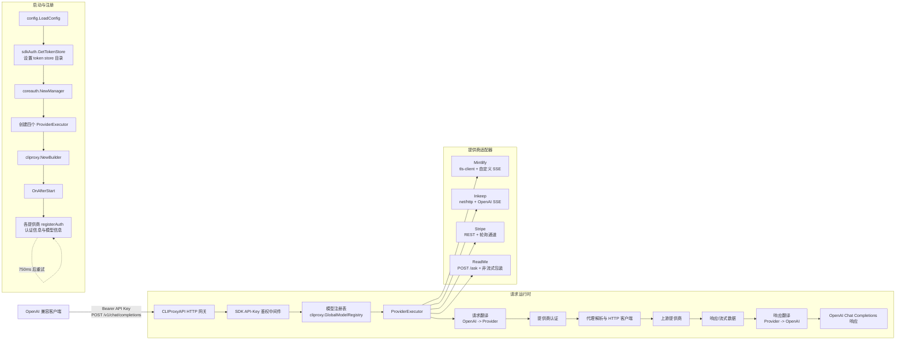
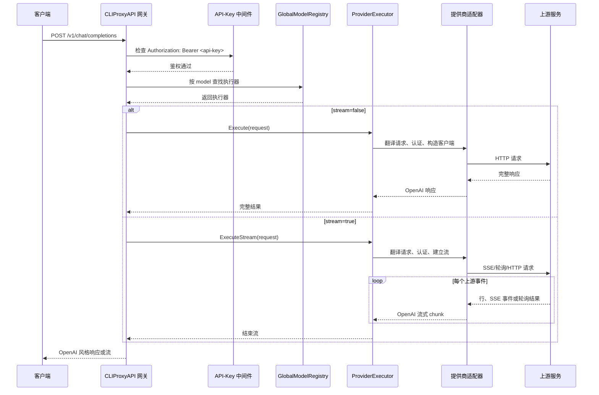
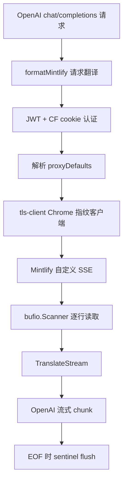
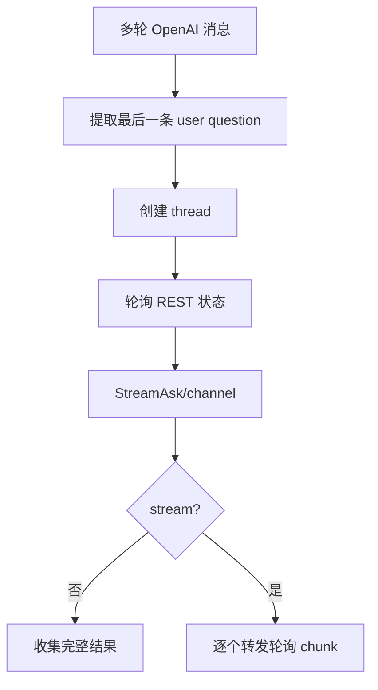
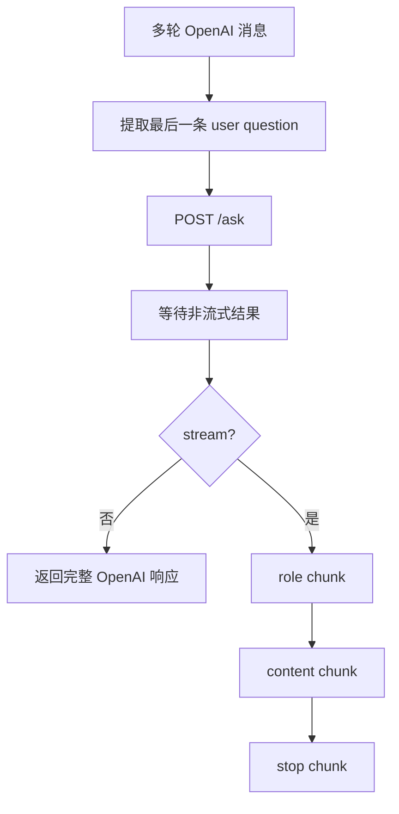

# docs-ai-reverse 架构说明

本文档描述 Go 项目 `docs-ai-reverse`（模块名：`claude-code-chat`）的整体架构、请求处理链路，以及 Mintlify、Inkeep、Stripe 和 ReadMe 四个上游提供商适配器的差异。

## 1. 总览

`docs-ai-reverse` 对外提供 OpenAI 风格的 HTTP 接口，对内通过 CLIProxyAPI SDK 将请求路由到不同的文档或知识库提供商。项目的核心职责不是重新实现网关，而是：

- 使用 CLIProxyAPI SDK 完成配置加载、认证管理、服务构建、鉴权中间件和模型注册。
- 为每个上游提供商实现一个 `ProviderExecutor`。
- 在 OpenAI 格式与提供商私有协议之间进行请求、响应和流式数据转换。
- 统一处理代理、令牌计数、会话连续性和错误映射。

### 1.1 总体架构图



其中，CLIProxyAPI 是公共的网关和生命周期框架；四个提供商适配器负责上游协议、认证、流式处理和格式转换等差异化逻辑。

### 1.2 分层职责

| 层 | 主要职责 |
| --- | --- |
| 客户端接口层 | 接收 OpenAI 风格的 `/v1/chat/completions` 请求，支持 `stream: true/false`。 |
| CLIProxyAPI 网关层 | 配置、服务构建、API Key Bearer 鉴权、执行器调用和统一的模型路由。 |
| 执行器层 | 实现 CLIProxyAPI 的 `ProviderExecutor` 接口，协调翻译、认证、代理、上游调用和响应转换。 |
| 提供商适配层 | 封装 Mintlify、Inkeep、Stripe、ReadMe 的协议、认证和流式语义。 |
| 公共基础设施层 | 代理解析、代理 HTTP 客户端、tiktoken 计数、错误截断和 Mintlify 会话状态管理。 |

## 2. 启动、注册与请求生命周期

### 2.1 启动阶段

服务启动时按以下顺序初始化：

1. 通过 `config.LoadConfig` 加载项目配置。
2. 设置 token store 的目录。
3. 通过 `coreauth.NewManager` 创建 CLIProxyAPI 核心认证管理器。
4. 创建四个提供商执行器：Mintlify、Inkeep、Stripe 和 ReadMe。
5. 使用 `cliproxy.NewBuilder` 构建 CLIProxyAPI 服务。
6. 服务构建完成后执行 `OnAfterStart` hook。
7. hook 中为每个提供商调用 `registerAuth`，注册认证信息和模型信息，并使模型能够进入 CLIProxyAPI 的模型注册体系。
8. 启动后约 750ms 再次执行注册流程，用于应对启动时序或依赖尚未就绪的情况。

SDK 负责持有认证管理器和全局模型注册表；项目代码负责将四个提供商的认证与模型元数据接入这些 SDK 扩展点。

### 2.2 单次非流式请求

客户端向 `/v1/chat/completions` 发送 `stream: false` 或未设置 `stream` 的请求时，处理流程如下：

1. CLIProxyAPI HTTP 层接收请求。
2. SDK 鉴权中间件检查 `Authorization: Bearer <api-key>`。
3. SDK 根据请求中的模型，在 `cliproxy.GlobalModelRegistry` 中找到对应的提供商执行器。
4. SDK 调用该执行器的 `Execute()`。
5. 执行器将 OpenAI Chat/Responses 请求转换为目标提供商所需的请求格式。
6. 执行器解析认证信息，必要时获取或刷新 token、cookie、challenge 等凭据。
7. 执行器按照代理优先级创建 HTTP 客户端并请求上游。
8. 执行器检查上游 HTTP 状态码，读取并截断错误体，或解析成功响应。
9. 执行器将提供商响应转换为 OpenAI Chat Completions 响应。
10. CLIProxyAPI 将结果返回给客户端。

### 2.3 单次流式请求

客户端发送 `stream: true` 时，公共流程保持一致，但 SDK 调用 `ExecuteStream()`：

1. 完成 API Key 鉴权、模型路由、请求翻译和提供商认证。
2. 建立上游流式连接，或为不支持原生流式的提供商创建等效的内部流。
3. 按提供商协议读取上游数据。
4. 将每个上游事件、行或轮询结果转换为 OpenAI 流式 chunk。
5. 在结束时写入必要的终止 chunk 或 `[DONE]` 语义。
6. 将流式错误转为网关可返回的错误，并确保上游响应体和内部通道得到释放。

### 2.4 生命周期流程图



## 3. 提供商适配器比较

### 3.1 能力与协议对比

| 提供商 | 传输客户端 | 认证方式 | 上游协议 | 流式协议/策略 | 主要翻译方式 |
| --- | --- | --- | --- | --- | --- |
| Mintlify | `tls-client`，使用 Chrome 指纹 | JWT token + Cloudflare cookies | 自定义 SSE，使用 `type:value` 行 | 自定义行 chunk | 通过注册的 `formatMintlify` 将 OpenAI Chat/Responses 转为 Mintlify 格式 |
| Inkeep | `net/http` | SHA-256 challenge + API key | OpenAI Chat SSE | 标准 SSE：`data: ...`，以 `[DONE]` 结束 | `FormatOpenAI-native`；保持 OpenAI 协议，只重写 model 与 message ID |
| Stripe | `net/http` | 无独立 token；使用 Origin/Referer | REST：创建 thread，再轮询 | 基于轮询结果的 channel | 提取最后一条用户问题，调用 `Ask` 或 `StreamAsk` |
| ReadMe | `net/http` | 无独立 token；使用 Origin/Referer | `POST /ask` | 上游非流式，适配器包装为伪流 | 提取最后一条用户问题，调用 `Ask` |

“无独立 token”不代表请求没有头部要求：Stripe 和 ReadMe 仍需要按照上游约定设置 `Origin`/`Referer`。

### 3.2 Mintlify

Mintlify 是协议差异最大、状态管理最复杂的适配器：

- 使用支持 Chrome 指纹的 `tls-client`，而不是普通 `net/http`，以满足上游 TLS/浏览器识别要求。
- 认证由 JWT token 和 Cloudflare cookies 共同组成。
- OpenAI Chat/Responses 输入先经过已注册的 `formatMintlify` 翻译为 Mintlify 私有格式。
- 上游返回自定义 SSE，每行遵循 `type:value` 形式，而不是标准的 `data: JSON` SSE 形式。
- 流式读取使用 `bufio.Scanner`，逐行调用 `TranslateStream`，并在结束时执行 sentinel flush，保证缓冲中的内容被发出。
- 处理 418 时可能需要代理重试或 cookie fallback；这部分逻辑是 Mintlify 特有的。
- 对话连续性通过 `ThreadID`、`ThreadKey` 和 `MessageID` 维护，并由 `sessionFor`/`updateSession` 在请求之间保存和更新。

Mintlify 还实现了 prompt-tool 协议。工具并不以标准 OpenAI tool_calls 字段直接传输，而是序列化到消息文本中的 XML/标记区域：

```text
<available_tools>...</available_tools>
...
<tool_call>...</tool_call>
```

在 `BufferTools` 模式下，适配器先把文本流式输出到 EOF，再解析其中的 `<tool_call>` XML。服务端 RAG 工具（类型 `9`/`a`）会被适配器吞掉，不会继续传递给客户端。

### 3.3 Inkeep

Inkeep 的上游协议接近 OpenAI：

- 使用普通 `net/http`。
- 请求前执行 SHA-256 challenge，并结合 API key 完成认证。
- 上游提供 OpenAI Chat SSE，因此不需要把请求转换成完全私有的结构。
- 适配器使用 `FormatOpenAI-native`，主要重写 model 和 message ID，使 ID 和项目内部会话或响应语义保持一致。
- 流式阶段扫描标准 SSE，修补每个 chunk 中的 model 字段，并把 `data: ...` 事件转换为客户端可理解的 chunk；遇到 `[DONE]` 时结束。

### 3.4 Stripe

Stripe 的请求模型是“创建线程 + 轮询”：

- 使用普通 `net/http`，不依赖 token 认证。
- 请求通过 `Origin`/`Referer` 头部满足上游访问约束。
- 适配器从消息列表中提取最后一条用户问题，而不是完整地把所有 OpenAI message 原样发送。
- 非流式路径调用 `Ask`。
- 流式路径调用 `StreamAsk`，上游结果通过 channel 产生；适配器可以收集 channel 内容形成完整响应，也可以逐项转发为流式 chunk。
- 由于上游本身是 REST 加轮询，客户端看到的流式输出是轮询结果被重新组织后的流，而非原生 SSE。

### 3.5 ReadMe

ReadMe 的上游接口更简单，但不支持原生流式：

- 使用普通 `net/http`。
- 不使用独立 token，依靠 `Origin`/`Referer`。
- 从请求中提取最后一条用户问题，调用 `Ask` 请求 `POST /ask`。
- 上游返回完整结果而不是增量事件。
- 当客户端要求 `stream: true` 时，适配器先完成非流式上游请求，再伪造标准流：发送 role chunk、content chunk 和 stop chunk。

因此 ReadMe 的“流式”只是一种客户端兼容层语义，不能降低上游响应等待时间。

## 4. 翻译层与不变量

### 4.1 翻译边界

项目把格式转换限制在提供商执行器内部，外部接口始终尽量保持 OpenAI Chat Completions 语义：

```text
客户端 OpenAI 请求
        |
        v
ProviderExecutor.RequestToFormat / provider translator
        |
        v
提供商私有请求
        |
        v
上游响应或流
        |
        v
ProviderExecutor.Translate / TranslateStream
        |
        v
客户端 OpenAI 响应或流式 chunk
```

CLIProxyAPI 的 `sdktranslator` 负责通用格式转换；适配器通过注册具体 translator（例如 Mintlify 的 `formatMintlify`）处理提供商私有结构。

所有执行器都满足 CLIProxyAPI 的 `clipexec.ProviderExecutor` 合约，必须提供以下能力：

- `Execute`
- `ExecuteStream`
- `CountTokens`
- `HttpRequest`
- `Refresh`
- `Identifier`
- `RequestToFormat`

这组方法使网关能够以统一方式处理完整响应、流式响应、令牌计数、底层请求、认证刷新、执行器标识和请求格式转换。

### 4.2 必须保持的不变量

1. **入口格式不变**：客户端可以使用统一的 OpenAI 风格请求，不需要知道后端是 Mintlify、Inkeep、Stripe 还是 ReadMe。
2. **模型路由一致**：执行器注册的模型信息必须与 `cliproxy.GlobalModelRegistry` 中的路由一致；模型注册和认证注册都在启动 hook 中完成。
3. **非流式与流式语义一致**：同一请求在 `stream: false` 和 `stream: true` 下应产生等价的最终文本，只是传输方式不同。ReadMe 的流式是包装后的兼容行为，Stripe 的流式是 channel/轮询结果的转发。
4. **翻译只发生在适配器边界**：不要把 Mintlify 的 `type:value` 行、prompt-tool XML 或 Stripe 的轮询结构泄漏到公共 OpenAI 响应中。
5. **流结束可观察**：Mintlify 的 sentinel flush、Inkeep 的 `[DONE]`、Stripe 的 channel 关闭、ReadMe 的 stop chunk 都必须被转换为明确的结束语义。
6. **会话 ID 可持续**：Mintlify 的 `ThreadID`、`ThreadKey`、`MessageID` 必须跨请求保存，否则多轮对话会被上游视为新会话。
7. **工具协议不混用**：标准 OpenAI tool_calls 与 Mintlify prompt-tool 协议不是同一层协议；Mintlify 工具需要在文本中编码、在结束时解析，并吞掉不应暴露给客户端的服务端 RAG 工具。
8. **错误不伪装成成功内容**：上游非 2xx 响应必须进入错误路径，不能被翻译器当作普通 assistant 文本返回。
9. **认证刷新可重试**：认证过期或挑战失败时，执行器应通过 `Refresh` 或提供商专用认证流程更新凭据，再决定是否重放请求。
10. **token 计数与模型能力一致**：所有提供商的模型都使用统一的本地计数函数，并对外声明 200K 上下文窗口。

## 5. 代理架构

### 5.1 代理解析优先级

项目通过 `proxyDefaults` 维护默认代理，并提供 `SetDefaultProxy` 与 `resolveProxy`。每次请求按以下优先级解析代理：

```text
auth.ProxyURL
    -> auth.Attributes["proxy"]
    -> defaultProxy
    -> 空字符串（不使用代理）
```

也就是说，认证条目上的显式 `ProxyURL` 优先级最高；没有显式字段时，再检查认证属性中的 `proxy`；最后使用全局默认代理。

### 5.2 HTTP 客户端创建

`httpClientForProxy` 根据解析结果构造客户端：

1. 解析当前认证对象和代理配置。
2. 按优先级得到代理地址。
3. 如果代理为空，构造普通 HTTP 客户端。
4. 如果代理非空，使用 `proxyutil.BuildHTTPTransport` 创建带代理的 transport，再构造 HTTP 客户端。
5. 将该客户端交给具体提供商适配器执行上游请求。

代理解析是公共基础设施，但 TLS 指纹、cookie fallback 和认证刷新仍属于提供商适配器的职责。Mintlify 因使用 `tls-client`，在代理路径上还需要保留 Chrome 指纹行为。

### 5.3 Mintlify 的 418 fallback

Mintlify 对 418 有特殊处理：该状态可能表示 VPN/网络来源被拦截。适配器可以根据认证和代理状态触发代理重试，并在适当情况下执行 cookie fallback。这个分支不能简单套用所有提供商共享的普通 HTTP 重试逻辑，因为：

- 418 在 Mintlify 中具有业务含义，而不是普通上游错误。
- 重试可能需要换代理。
- cookie 可能需要清理、重新获取或回退到备用 cookie。
- 重试结果必须与原始会话和 JWT 状态保持一致。

## 6. Token 计数与上下文窗口

### 6.1 计数策略

四个提供商都通过本地 `countTokensResponse()` 计算 token 数量，底层使用 `tiktoken-go` 的 `o200k_base` 编码。计数流程不依赖上游提供商的计数 API：

```text
OpenAI 风格请求
        |
        v
提取请求中的模型、消息和文本
        |
        v
使用 tiktoken-go / o200k_base 计算
        |
        v
构造 CountTokens 响应
```

每个执行器实现 `CountTokens`，但实际计数算法保持一致，从而让 CLIProxyAPI 能以相同方式处理四个提供商。

### 6.2 模型上下文窗口

所有提供商的模型对外都宣传为 **200K context window**。该值是网关的统一能力声明，客户端可以据此规划请求长度；它不是对每个上游私有模型实现细节的重新发现。

### 6.3 设计约束

- 计数函数应与真正发送给模型的消息结构保持一致，尤其要注意工具文本、prompt-tool 编码和多轮消息。
- Mintlify 的工具会序列化到消息文本，若这些文本最终会发送给上游，计数时也应将其视为请求内容的一部分。
- Stripe 和 ReadMe 会提取最后一条用户问题；其上游实际发送内容与原始完整消息列表不同，但对外的 `CountTokens` 仍由统一的本地响应函数提供。
- 计数错误不应影响正常请求翻译；`CountTokens` 是执行器契约的一部分，不能替代上游调用路径。

## 7. 错误处理模式

### 7.1 通用 HTTP 错误规则

对一般提供商请求，响应状态码满足以下条件时视为失败：

```text
status < 200 或 status >= 300
```

错误处理通常包括：

1. 读取上游响应体。
2. 截断响应体，避免异常体无限增长或污染网关日志。
3. 将状态码、提供商标识和截断后的 body 组合成执行器错误。
4. 由 CLIProxyAPI 将错误传递给客户端。

成功状态不能仅凭“能读到 body”判定；必须先检查 HTTP status。

### 7.2 Mintlify 状态码映射

Mintlify 的状态码具有明确业务含义：

| 状态码 | 含义 | 处理方向 |
| --- | --- | --- |
| 402 | 付款或订阅问题 | 返回 payment 类错误，不把响应伪装为内容成功。 |
| 418 | VPN/来源被阻断 | 根据代理配置执行代理重试或 cookie fallback。 |
| 419 | token 过期 | 使当前 token 失效，触发刷新或重新认证。 |
| 420 | Cloudflare bot 检测 | 清理/刷新 cookie，并按认证流程重新尝试。 |

这些状态码必须在 Mintlify 适配器中先于通用错误处理解释，否则会丢失可恢复动作。

### 7.3 认证、代理与上游错误的边界

- **API Key 鉴权错误**：发生在 CLIProxyAPI 的 SDK 中间件，通常在请求尚未进入提供商执行器前返回。
- **提供商认证错误**：发生在执行器内部，例如 JWT、cookie、SHA-256 challenge 或 token 失效。
- **代理连接错误**：发生在 `httpClientForProxy` 创建或使用 proxied transport 时。
- **上游业务错误**：发生在上游返回非 2xx 状态时，由适配器按提供商规则映射。
- **流式解析错误**：发生在 scanner、SSE JSON、channel 或伪流包装过程中，应终止当前流并返回错误，而不是继续发送不完整 chunk。

### 7.4 重试边界

重试必须只发生在适配器知道如何恢复的场景：

- Mintlify 418 可触发代理/cookie fallback。
- Mintlify 419 可触发 token invalidation 和刷新。
- Mintlify 420 可触发 Cloudflare cookie 清理与刷新。
- 其他提供商的 challenge、API key、线程或轮询错误应遵循各自认证和协议逻辑。

不能对所有非 2xx 无条件重放请求，因为重复创建 Stripe thread、重复提交 ReadMe 问题或重复发送带工具调用的 Mintlify 请求可能改变上游状态。

## 8. CLIProxyAPI 集成点

### 8.1 SDK 组件与项目职责

| CLIProxyAPI 组件 | 在项目中的作用 |
| --- | --- |
| `config.LoadConfig` | 读取服务配置、认证配置和默认运行参数。 |
| `coreauth.NewManager` | 创建核心认证管理器，供各提供商注册和刷新认证。 |
| `sdkAuth.GetTokenStore` | 获取 token store，并在启动时设置其目录。 |
| `cliproxy.NewBuilder` | 构建 HTTP/gateway 服务，并承载启动 hook。 |
| `clipexec.ProviderExecutor` | 四个提供商执行器实现的统一接口。 |
| `cliproxy.GlobalModelRegistry` | 保存模型与执行器的映射，支持按 model 路由请求。 |
| `sdktranslator` | 提供 OpenAI 与提供商格式之间的通用转换能力。 |
| `OnAfterStart` | 在服务启动后执行 `registerAuth`，完成认证和模型注册。 |
| API-key middleware | 检查客户端的 Bearer API Key，并在执行器调用之前拒绝未授权请求。 |

### 8.2 Executor 接口

每个适配器都以一个执行器为中心。执行器至少包含以下方法：

```text
Execute
ExecuteStream
CountTokens
HttpRequest
Refresh
Identifier
RequestToFormat
```

方法职责可以按以下方式理解：

- `Execute`：执行完整的非流式请求。
- `ExecuteStream`：执行流式请求，并将上游事件转换成客户端流。
- `CountTokens`：返回本地 token 计数结果。
- `HttpRequest`：暴露或构造适配器所需的底层 HTTP 请求能力。
- `Refresh`：刷新 token、cookie、challenge 或其他认证状态。
- `Identifier`：返回执行器/提供商标识。
- `RequestToFormat`：选择或执行请求格式转换。

### 8.3 注册顺序与可用性

模型只有在以下链路完成后才应被视为可路由：

```text
创建执行器
    -> OnAfterStart
    -> registerAuth
    -> 注册认证信息
    -> 注册模型信息
    -> GlobalModelRegistry 可查找
```

启动后 750ms 的再次注册是启动可靠性机制，不应被当成新的业务请求流程。运行时如果模型找不到，问题通常出在注册时序、模型元数据或 `Identifier`/路由映射，而不是上游翻译逻辑。

## 9. 典型数据流细节

### 9.1 Mintlify 流



如果启用 prompt-tool，工具定义会进入消息文本，工具调用在 EOF 后从 XML 标记中解析；服务端 RAG 类型 `9`/`a` 不出现在客户端输出中。

### 9.2 Inkeep 流

```mermaid
flowchart TD
    A[OpenAI 请求] --> B[FormatOpenAI-native]
    B --> C[SHA-256 challenge + API key]
    C --> D[net/http]
    D --> E[标准 OpenAI SSE]
    E --> F[SSE scanner]
    F --> G[修补 model 字段]
    G --> H[发送 data chunk]
    H --> I[data: [DONE]]
```

### 9.3 Stripe 流



### 9.4 ReadMe 流



## 10. 维护与扩展指南

增加新的提供商时，建议沿用以下边界：

1. 创建一个实现 `ProviderExecutor` 合约的执行器。
2. 明确提供商的认证状态、刷新策略和是否需要会话持久化。
3. 选择普通 `net/http`、`tls-client` 或其他必要的传输层，并接入 `httpClientForProxy` 的代理解析。
4. 在 `RequestToFormat` 或专用 translator 中实现 OpenAI 到上游的转换。
5. 分别实现完整响应和流式响应，明确流结束标记。
6. 实现 `CountTokens`，复用本地 `countTokensResponse()` 和 200K 模型能力声明。
7. 在 `OnAfterStart` 中通过 `registerAuth` 注册认证和模型信息。
8. 为可恢复的认证、代理和上游状态定义有边界的错误重试。
9. 将提供商特有的协议细节限制在适配器内部，不改变公共 OpenAI 接口。

架构的关键原则是：CLIProxyAPI 负责通用网关生命周期和路由；执行器负责一个提供商的完整适配闭环；公共辅助设施负责重复出现的代理、计数和错误处理，而不替代提供商特有的认证和协议逻辑。
