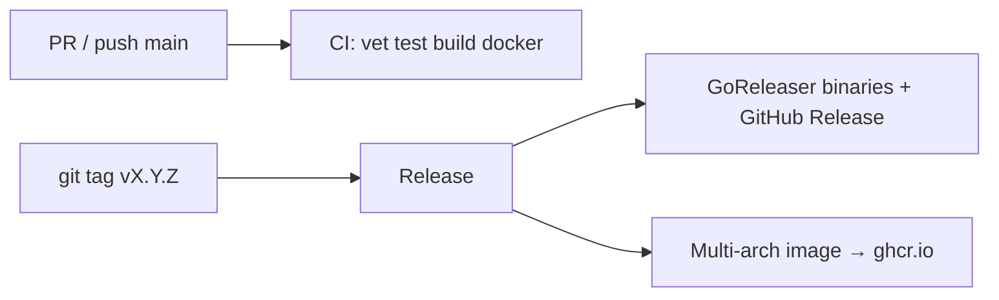

# CI/CD 与版本发布

`docs-ai-reverse` 使用 GitHub Actions 完成持续集成与发布。流程遵循常见最佳实践：**CI 与 CD 分离**、**SemVer 标签触发发布**、**GHCR + 内置 `GITHUB_TOKEN`**、**GoReleaser 产出跨平台二进制与 GitHub Release**。

## 流水线概览

| Workflow | 触发 | 作用 |
|---|---|---|
| [`.github/workflows/ci.yml`](../.github/workflows/ci.yml) | `push` / `pull_request` → `main` | `go vet`、`go test`、`go build`；校验 Docker 镜像可构建（不推送） |
| [`.github/workflows/release.yml`](../.github/workflows/release.yml) | 推送 tag `v*.*.*` | 测试 → GoReleaser（二进制 + GitHub Release）→ 多架构镜像推送到 GHCR |



## 版本号约定

使用 [Semantic Versioning](https://semver.org/)，Git tag 必须以 `v` 开头：

| Tag | 含义 |
|---|---|
| `v1.2.3` | 正式版 |
| `v1.2.3-rc.1` | 预发布（GitHub Release 自动标为 prerelease；不更新 Docker `latest`） |

不要用手改二进制里的版本字符串；版本由 GoReleaser / Docker `ldflags` 注入到 `main.version`。

## 发布步骤

1. 确保 `main` 已合并目标提交，且 CI 通过。
2. 创建并推送 tag：

```bash
git checkout main
git pull
git tag -a v0.1.0 -m "v0.1.0"
git push origin v0.1.0
```

3. 在 Actions 中等待 **Release** workflow 完成。
4. 检查：
   - GitHub Releases：https://github.com/6Kmfi6HP/docs-ai-reverse/releases
   - 容器包：https://github.com/6Kmfi6HP/docs-ai-reverse/pkgs/container/docs-ai-reverse

首次推送 GHCR 后，在 Package settings 中把可见性设为 Public（如需要），并确认 package 已关联本仓库。

## 产物

### GitHub Release 二进制

GoReleaser 构建：

- `linux` / `darwin` / `windows`
- `amd64` / `arm64`（Windows arm64 除外）
- 归档内含 `README.md`、`README.en.md`、`config.example.yaml`
- `checksums.txt`

本地查看版本：

```bash
./docs-ai-reverse --version
```

### Docker 镜像（GHCR）

镜像名（必须小写）：

```text
ghcr.io/6kmfi6hp/docs-ai-reverse
```

标签策略（`docker/metadata-action`）：

| Tag 示例 | 说明 |
|---|---|
| `v1.2.3` / `1.2.3` | 与 Git tag 对应的不可变版本 |
| `1.2` | major.minor 浮动标签 |
| `latest` | 仅正式版（不含 `-` 的 prerelease 标记） |

多架构：`linux/amd64`、`linux/arm64`。构建启用 provenance / SBOM，并写入 build provenance attestation。

## 运行 Docker 镜像

容器默认入口读取 `/config/config.yaml`。**必须**把配置里的 `host` 设为 `0.0.0.0`，否则外部无法访问。

```bash
cp config.example.yaml config.yaml
# 编辑 config.yaml：
#   host: "0.0.0.0"
#   port: 8317
#   api-keys: ["sk-local-demo"]

docker run --rm -p 8317:8317 \
  -v "$(pwd)/config.yaml:/config/config.yaml:ro" \
  -v "$(pwd)/auths:/app/auths" \
  ghcr.io/6kmfi6hp/docs-ai-reverse:latest
```

从私有包拉取时：

```bash
echo "$GHCR_TOKEN" | docker login ghcr.io -u USERNAME --password-stdin
```

## 权限与安全要点

- 使用内置 `GITHUB_TOKEN`，不额外配置长期 PAT（发布到 GHCR 需要 `packages: write`）。
- Release job 显式声明最小权限：`contents` / `packages` / `attestations` / `id-token`。
- Docker 层使用 GHA cache；CI 只 build 不 push。
- 镜像基于 `distroless/static`，以 `nonroot` 运行。
- 不要把 `config.yaml`、`auths/` 或真实密钥打进镜像；它们已在 `.dockerignore` 中排除。

## 本地校验（可选）

```bash
# 与 CI 对齐
go vet ./...
go test ./...
go build -o docs-ai-reverse .

# 本地试构建镜像
docker build -t docs-ai-reverse:local .

# 本地试跑 GoReleaser（不发布）
goreleaser release --snapshot --clean
```

## 相关文件

| 文件 | 作用 |
|---|---|
| [`Dockerfile`](../Dockerfile) | 多阶段构建生产镜像 |
| [`.dockerignore`](../.dockerignore) | 排除密钥与无关文件 |
| [`.goreleaser.yaml`](../.goreleaser.yaml) | 二进制与 Release 配置 |
| [`.github/workflows/ci.yml`](../.github/workflows/ci.yml) | 持续集成 |
| [`.github/workflows/release.yml`](../.github/workflows/release.yml) | 版本发布 |
